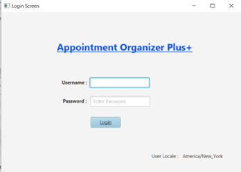
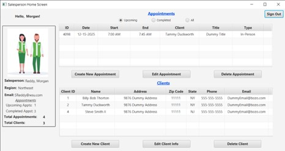
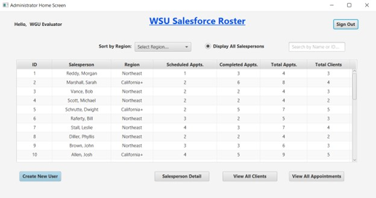

  

# 📅 Appointment Organizer Plus+ | Software Capstone

A comprehensive, multi-role appointment management system built to demonstrate full-stack software engineering principles, rigorous QA validation, and secure database architecture.

**📁 Master Documentation:** [View Project Full Summary](./docs/Project_Full_Summary.pdf)

---

## 🛠 Technical Architecture & Tech Stack
This application utilizes an **MVC (Model-View-Controller)** design pattern to ensure a clean separation of concerns between data, business logic, and the user interface.

* **Core Language:** Java 17 (LTS)
* **Frontend:** JavaFX (Modular Desktop GUI)
* **Database:** MySQL 8.0 (AWS RDS integration adapted for local portfolio use)
* **Build Tool:** Maven (Dependency Management)

---

## ✅ Quality Assurance & Validation
The core of this project is the **17-point Unit Test Plan**, which verified every use case from administrative user creation to salesperson-specific data filtering.

* **Constraint Validation:** Implemented custom logic to prevent conflicting appointments for both customers and sales staff.
* **RBAC (Role-Based Access Control):** Secure login architecture that dynamically renders the GUI based on user permissions (Administrator vs. Salesperson).
* **Regression Testing:** Conducted systematic verification of CRUD operations to ensure database synchronization remained perfect throughout the development lifecycle.

---

## 🏗 Key Features
* **Dynamic Roster Filtering:** Real-time search and sort functionality by region, ID, or name.
* **Automated Reporting:** Real-time salesperson stats tracking (Scheduled vs. Completed appointments).
* **Relational Persistence:** Secure handling of client records and appointment history with automated primary/foreign key relationship management.

---

## 💻 How to Run Locally
*This project was originally designed for a cloud-based AWS database but has been updated to run completely offline for portfolio demonstration purposes.*

### Prerequisites
* **Java JDK 17** or higher.
* **MySQL Server 8.0** (Community Edition).
* **IntelliJ IDEA** (Recommended IDE).

### Step 1: Database Setup
1.  Install **MySQL Server** and **MySQL Workbench**.
2.  During installation, set the **Root Password** to `root`.
    > *Note: If you use a different password, you must update the `password` variable in `src/database/JDBC.java`.*
3.  Open MySQL Workbench.
4.  Open the file `database_setup.sql` located in the root of this project.
5.  Run the entire script (Lightning Bolt icon) to create the database and populate it with sample data (Regions, States, Salespeople, Clients, and Appointments).

### Step 2: Project Configuration
1.  Open the project in **IntelliJ IDEA**.
2.  Allow the IDE to import dependencies from the `pom.xml` file (Maven).
    * *This automatically downloads JavaFX and the MySQL Connector.*
3.  Ensure your Project SDK is set to **Java 17** (`File` > `Project Structure` > `Project`).

### Step 3: Launch the Application
1.  Navigate to `src/main/Launcher.java`.
2.  Click the **Green Play Button** (Run).
    * *Do not run `Main.java` directly as it may cause JavaFX runtime errors.*

---

## 🔑 Login Credentials

| Role | Username | Password | Region Access |
| :--- | :--- | :--- | :--- |
| **Administrator** | `admin` | `Passw0rd!` | Global (All Regions) |
| **Salesperson** | `sales_ne` | `12345` | Northeast Region Only |

## ENJOY!!!